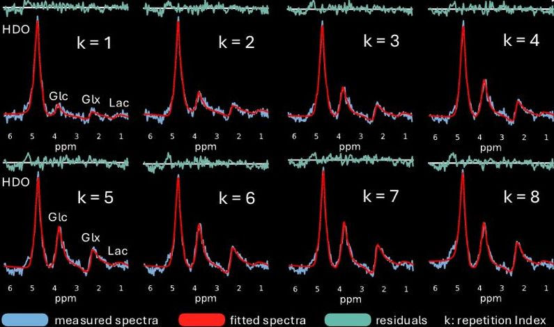

# A Deep Autoencoder for Fast Spectral-Temporal Fitting of Dynamic Deuterium Metabolic Imaging Data at 7T

This repository contains the source code implementing the proposed model from our article "A Deep Autoencoder for Fast Spectral-Temporal Fitting of Dynamic Deuterium Metabolic Imaging Data at 7T"

## Installation and Usage
Clone and install the repository using
```
git clone git@github.com:Osburg/dynamic_fitting.git
cd dynamic_fitting
pip install -e .
```
Additionally, the dependency (torchcubicspline)[https://github.com/patrick-kidger/torchcubicspline] must be installed. This can be done via
```
pip install git+https://github.com/patrick-kidger/torchcubicspline.git
```

Before training the model, prepare a basisset and datasets by running the commands
```
python ./dldf/data_preparation/read_data.py --config ./config/prepare_data.json
python ./dldf/data_preparation/read_basis.py --config ./config/prepare_data.json
```
where the paths to the dynamic DMI data and the basis signals (as .txt files) are provided in the configuration file `./config/prepare_data.json`. Then, start the training pipeline (configured using `./config/config.json`) by running
```
python ./main.py --mode train --config ./config/config.json
```


## Architecture


## Results



## Reference
If you use this code in your research, please cite the our paper:
@article{OSBURG2025121632,
title = {A deep autoencoder for fast spectral–temporal fitting of dynamic deuterium metabolic imaging data at 7T},
journal = {NeuroImage},
volume = {324},
pages = {121632},
year = {2025},
issn = {1053-8119},
doi = {https://doi.org/10.1016/j.neuroimage.2025.121632},
url = {https://www.sciencedirect.com/science/article/pii/S1053811925006354},
author = {Aaron Paul Osburg and Amirmohammad Shamaei and Bernhard Strasser and Fabian Niess and Anna Duguid and Viola Bader and Sabina Frese and Lukas Hingerl and Hauke Fischer and William T. Clarke and Georg Langs and Wolfgang Bogner and Stanislav Motyka},
}
```
